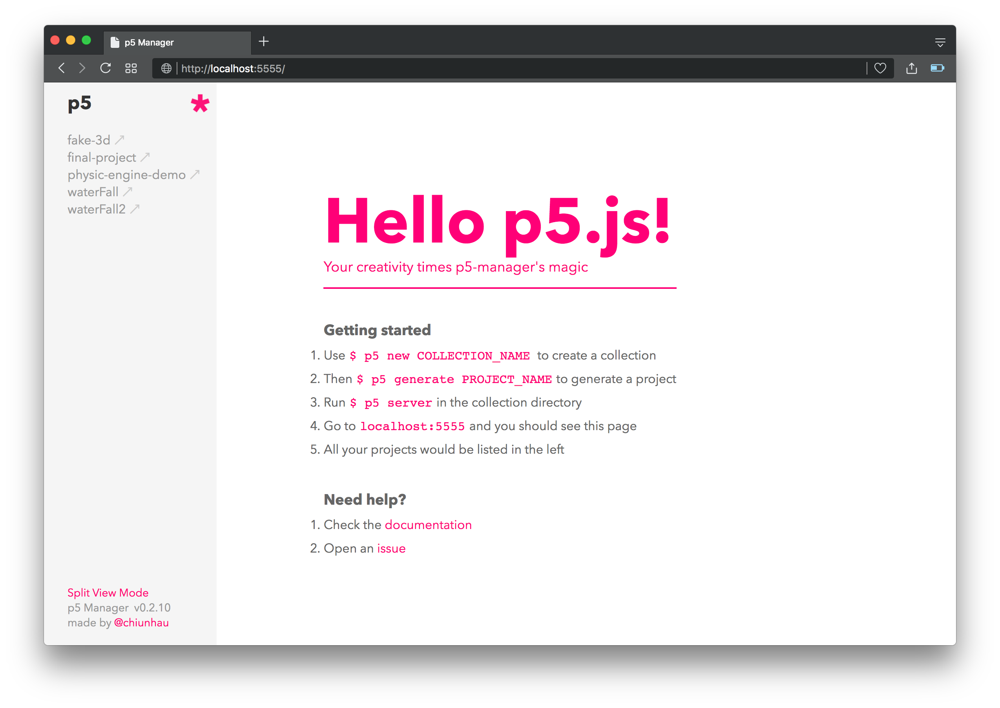

 [](https://badge.fury.io/js/p5-manager)

p5-manager is a [p5js](https://github.com/processing/p5.js/) template builder and sketch manager. This command-line tool also supports livereload, Babel ES6 auto-compiling and other useful features. Built for p5.js enthusiasts.



## Quick Start

```bash
$ npm install -g p5-manager
```

There are several use case of p5-manager, Before going further, choose the one best describe your requirements and go ahead.
- I want to handle multiple sketches at the same time. Go check `Collection`.
- I want livereload or babel auto-compiling to improve my p5.js development experience. Go check `Collection`.
- I just need a CLI command to easily initialize a new p5 project (with default p5.js libraries in it). Go check `Bundle`.

## Collection
### Step 1: Initialize a new collection
```bash
$ p5 new my_collection
```

By running this command, it will create a collection directory and some p5 libraries to it. See the output log:

```bash
# create : my_collection
# create : my_collection/libraries
# create : my_collection/libraries/p5.js
# ...
```

### Step 2: Generate a p5 project

```bash
$ cd my_collection
$ p5 generate my_project
# or...
$ p5 g my_project
```

This will generate a p5 project folder with default templates in it. (Make sure you are running this command in a collection directory.)

```bash
# create : my_project
# create : my_project/sketch.js
# create : my_project/index.html
```

### Step 3: Start the server and have fun!

```bash
$ p5 server
# or...
$ p5 s
```

Now edit your sketch.js and go to `localhost:5555`, then p5-manager will do the rest. The server supports livereload as default. (Notice: You should run `p5 server` in a collection directory, instead of a project directory.)

## Bundle
You don't always need a collection in some cases. p5-manager also allows you to generate a standalone bundled project with its own p5 libraries included. You can use this command anywhere without GUI or collection mentioned above. Just make sure to add the flag correctly.

```bash
p5 generate --bundle PROJECT_NAME
# or...
p5 g -b PROJECT_NAME
```
Which will do something like this:

```bash
# create : my_project
#   create : my_project/sketch.js
#   create : my_project/index.html
#   create : my_project/libraries
#   create : my_project/libraries/p5.js
#   create : my_project/libraries/p5.sound.js
#   create : my_project/libraries/p5.dom.js
```


## Advanced Usage

### Split view mode
You can run two sketches simultaneously in split view mode. Just click the link in the bottom of sidebar and enter split view mode.


### Static mode v.s GUI mode in Collection
There are two ways to get access to your sketch in a collection. One is public path, ex: `localhost:5555/demo1/index.html`. The other way is GUI mode, just go to: `localhost:5555`.

### Using Babel ES6

Simply add a flag after the `p5 generate` command. Then you'll have a `sketch.es6` file in the project. Those files with `.es6` extension would be automatically compiled to `.js` file, to the same directory every time you save them.

```bash
$ p5 g my_project_es6 --es6
```

### Customize port

```bash
p5 server --port 8888
# or...
p5 s -p 8888
```

### Update libraries
We provide a decent method to update p5 libraries to the latest version:

```bash
$ cd my_collection
$ p5 update
# or...
$ p5 u
```
By running this, p5-manager will check the latest release tag of p5.js on github, and download `p5.js`, `p5.dom.js` and `p5.sound.js` to the `libraries` folder in your collection. (This might break your projects since they depends on older p5.js libraries.)

### .p5rc
The main purpose of `.p5rc` is to track projects in the collection. Once you generate a project with command `p5 generate`, it will be automatically added to `.p5rc`. Projects listed in the `.p5rc` file would be served in the GUI mode.

Currently, if you create a project without using `p5 generate`, you'll have to append the project name into `.p5rc` on your own, to add it to stage. Please follow the rule of JSON formatting when doing this.

## About this project
I'm a graphic design student who use p5.js a lot so I need something to help me develop, manage or demo my p5.js projects more efficiently. That's why p5-manager was made.

Inspired by [kadamwhite/p5-cli](https://github.com/kadamwhite/p5-cli) and [express/generator](https://github.com/expressjs/generator).

Distributed under the MIT license.
